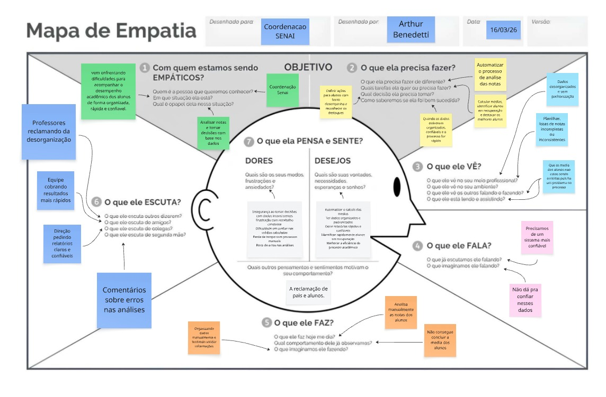
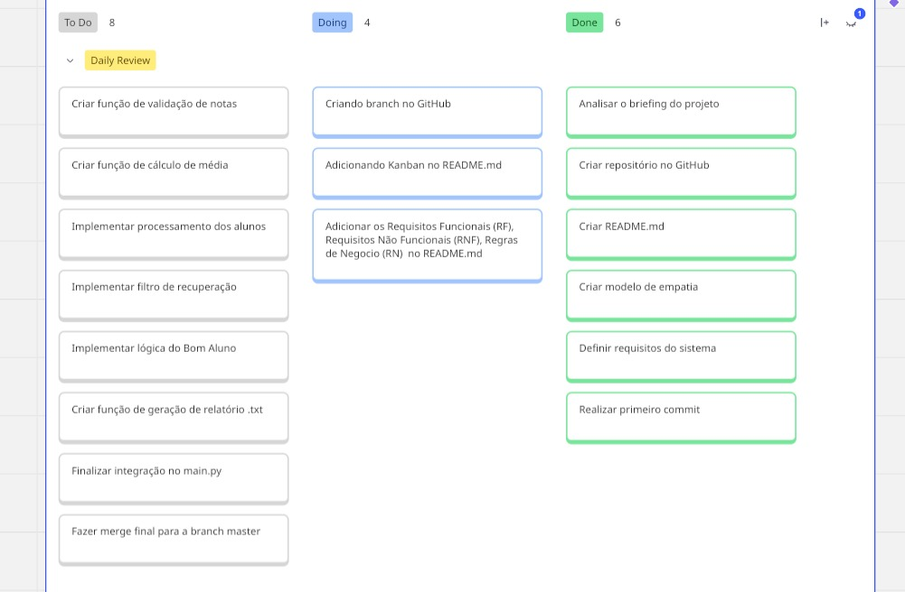

# Sistema de Análise de Desempenho Acadêmico
Projeto desenvolvido com o objetivo de ajudar a coordenação do SENAI a analisar o desempenho dos alunos de forma mais rápida, organizada e confiável.

# Sobre o Projeto
Atualmente, o processo de análise de notas é feito de forma manual, o que gera:
- Dados desorganizados
- Possíveis erros de cálculo
- Retrabalho constante
- Dificuldade na tomada de decisão

# Design Thinking

# Mapa de Empatia
Acesse o mapa completo:
https://miro.com/app/board/uXjVGwxcw1Y=/

# Visual do Mapa

# Metodologia Ágil
# Kanban
Acesse o quadro Kanban:
https://miro.com/app/board/uXjVGwxOsFg=/

# Visual do Kanban

# Levantamento de Requisitos

# Requisitos Funcionais (RF)

- RF01: O sistema deve receber uma lista de alunos no formato de tuplas ("Nome", [notas]).  
- RF02: O sistema deve verificar se a lista de notas de cada aluno não está vazia ou com dados inválidos.  
- RF03: O sistema deve calcular a média das notas de cada aluno.  
- RF04: O sistema deve percorrer os dados utilizando estruturas de repetição.  
- RF05: O sistema deve identificar quais alunos estão em recuperação (média < 7.0).  
- RF06: O sistema deve identificar o aluno com a maior média.  
- RF07: O sistema deve gerar um relatório final em arquivo .txt com os resultados.  
- RF08: O sistema deve mostrar mensagens quando encontrar dados inválidos.  

# Requisitos Não Funcionais (RNF)
